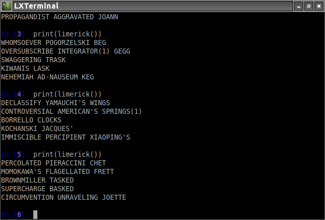

##Python Rhyme

A simple set of tools for grabbing words with a certain number of syllables or words that rhyme, etc.

To see examples of use and how code works, look at the source of `rhyme.py`.

Phonetic dictionary obtained from [here](http://www.speech.cs.cmu.edu/cgi-bin/cmudict).
